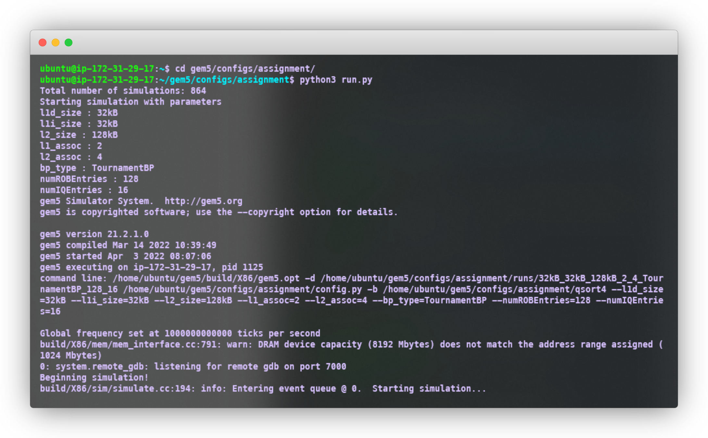
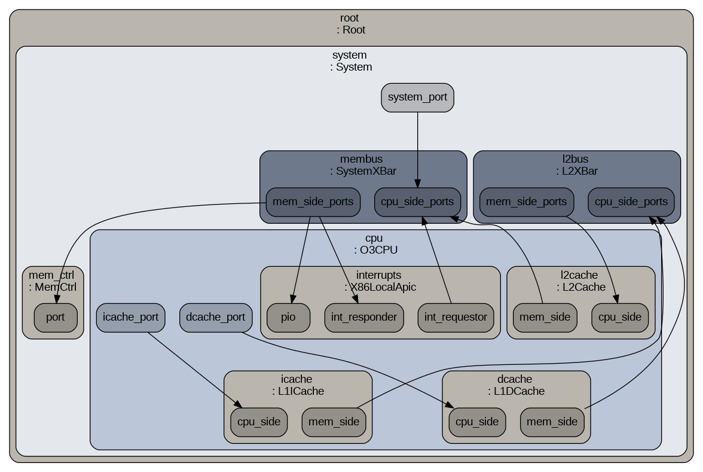

# HPCA-Assignment-1

Benchmarking with GEM5 simulation

## Important Files

- **_config.py\:_** Configuration file for the gem5 simulation.
- **_options.py\:_** File for arguments for the config script.
- **_run.py\:_** File for running the gem5 simulation on multiple configurations provided.
- **_plot.py\:_** File for plotting the results of the gem5 simulation.
- **_qsort4\:_** Binary file of the quicksort algorithm, will be used for the benchmark.
- **_m5out/:_** Directory for the gem5 simulation output for top 10 configurations.
  - **_stats.txt\:_** File containing the gem5 simulation statistics.

## Built With

Following mentioned are the major frameworks/libraries used to bootstrap this project. Also included are the dependencies and addons used in this project.

- [gem5](https://gem5.org/) - The gem5 simulator.
- [python](https://www.python.org/) - Python for configuration and plotting scripts.
- [matplotlib](https://matplotlib.org/) - Python library for plotting.
- [seaborn](https://seaborn.pydata.org/) - Python library for plotting.
- [process](https://docs.python.org/3/library/subprocess.html) - Python library for running shell commands.

## Project Structure

```
.
├── README.md
├── config.py
├── m5out
│   ├── 64kB_32kB_512kB_4_8_TournamentBP_128_64
│   │   └── stats.txt
│   ├── 64kB_32kB_512kB_4_8_TournamentBP_192_16
│   │   └── stats.txt
│   ├── 64kB_32kB_512kB_8_8_BiModeBP_128_16
│   │   └── stats.txt
│   ├── 64kB_32kB_512kB_8_8_BiModeBP_128_64
│   │   └── stats.txt
│   ├── 64kB_32kB_512kB_8_8_BiModeBP_192_16
│   │   └── stats.txt
│   ├── 64kB_32kB_512kB_8_8_BiModeBP_192_64
│   │   └── stats.txt
│   ├── 64kB_32kB_512kB_8_8_TournamentBP_128_16
│   │   └── stats.txt
│   ├── 64kB_32kB_512kB_8_8_TournamentBP_128_64
│   │   └── stats.txt
│   ├── 64kB_32kB_512kB_8_8_TournamentBP_192_16
│   │   └── stats.txt
│   └── 64kB_32kB_512kB_8_8_TournamentBP_192_64
│       └── stats.txt
├── options.py
├── plot.py
├── qsort4
└── run.py
```

## Getting Started

### Installing GEM5 and dependencies

```bash
# Install gem5 (inside your home directory)

# Install dependencies
$ sudo apt install build-essential git m4 scons zlib1g zlib1g-dev \
         libprotobuf-dev protobuf-compiler libprotoc-dev\
         libgoogle-perftools-dev python-dev python


# Clone the repository of gem5
$ git clone https://gem5.googlesource.com/public/gem5


# Change directory to gem5
$ cd gem5

# Build the binary
$ python3 `which scons` build/X86/gem5.opt -j9
```

---

### Case 1: Cloning github repository

```bash
# Clone github repository or use the submission
$ git clone https://github.com/debajyotidasgupta/HPCA-Assignment-1.git

# Change directory to assignment
$ cd HPCA-Assignment-1

# Copy files from the assignment directory to the benchmark programs directory
$ cp -r assignment/ ~/gem5/configs/
```

---

### Case 2 using assignment submission

```bash
# Create assignment directory in the gem5/config directory
$ mkdir ~/gem5/configs/assignment

# Copy the contents of the submission to the assignment directory
$ cp -r Group_5_HPCA_Assignment_1/* ~/gem5/configs/assignment/
```

---

### Running the simulation

```bash
# Change directory to the gem5 root directory
$ cd ~/gem5

# Run the gem5 simulation
$ build/X86/gem5.opt -d configs/assignment/m5out configs/assignment/config.py -b configs/assignment/qsort4

# To run simulations with all possible configurations
$ cd ~/gem5/configs/assignment
$ python3 run.py

# Running run.py file will generate the runs/ folder
# which will contain all the sinultation results

# To run plots file
$ python3 plot.py
```

## Images

---

### Running the simulation with all possible configurations



### Configuration image generated by the simulator


